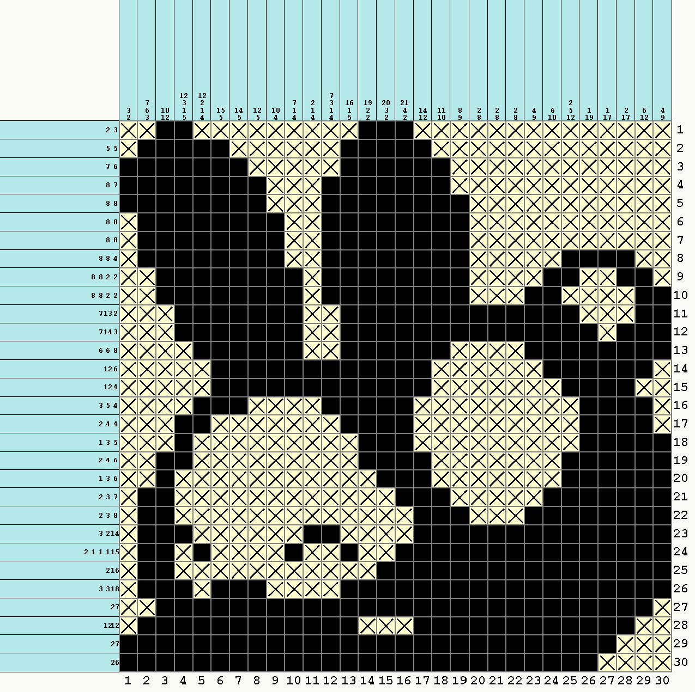
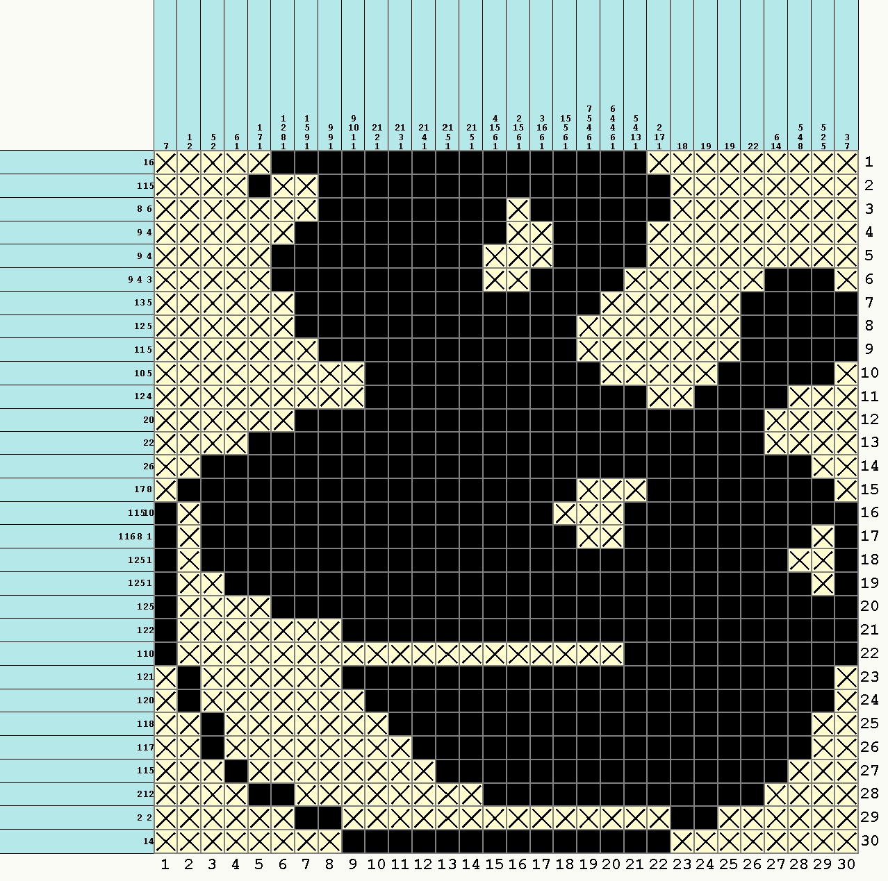
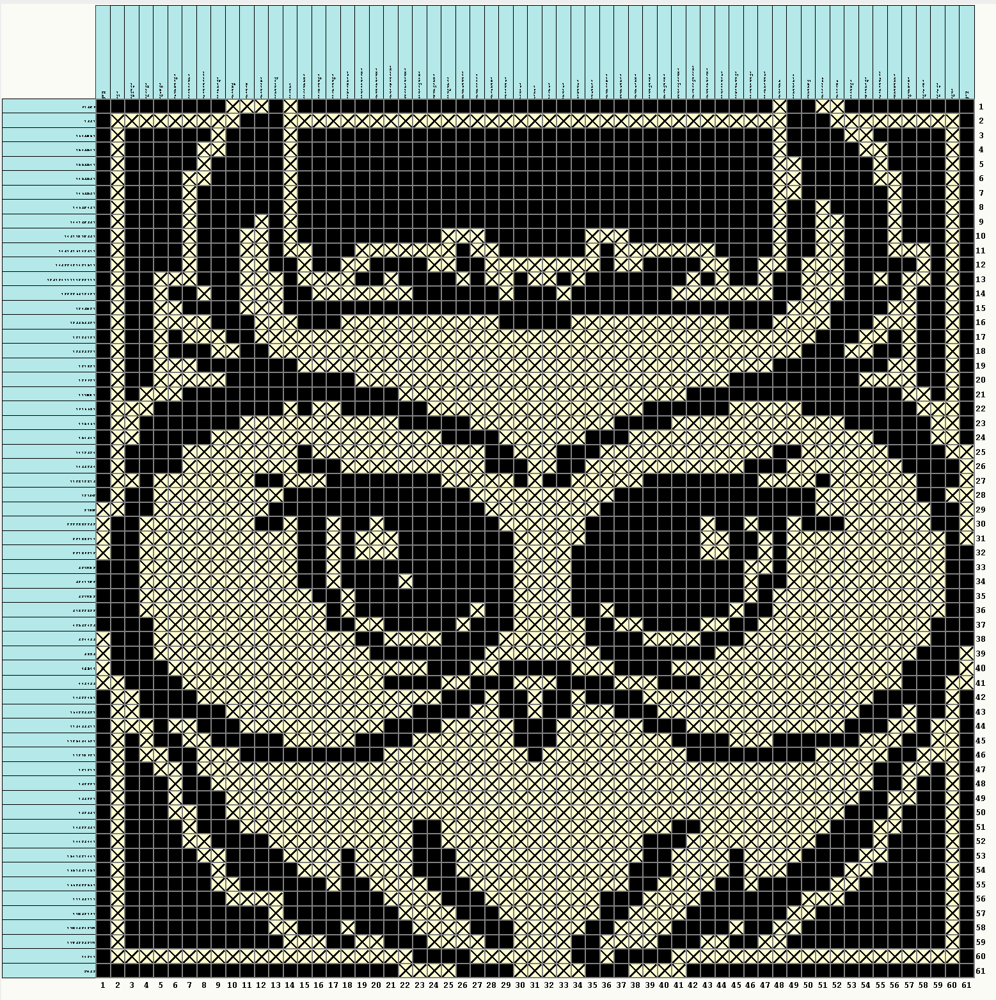

# Nonogram

## Description
This program takes in data from a file, which represents the row and column rules of a Nonogram and uses the data to solve it as much as statistically possible. If there are still tiles remaining after trying to solve the Nonogram, a UI can be called that allows the user to manually place the rest of the tiles.

## File format
int (number of rows)  
Rule 1  
Rule 2  
Rule 3  
...  
Enter   
int (number of columns)  
Rule 1  
Rule 2  
Rule 3  
...  

## How to run the program
1. Open folder in Intelij and run file
2. Select a text file inside the folder or create a new one for yourself
3. Call the solve Nonogram to solve the nonogram and run the display method

## Images of program running
<table style="border: none">
  <tr>
    <td valign="top"></td>
    <td valign="top"></td>
    <td valign="top"></td>
   </tr>
</table>
